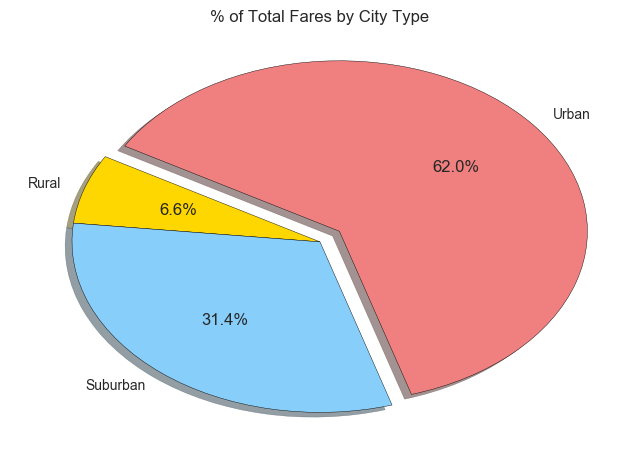
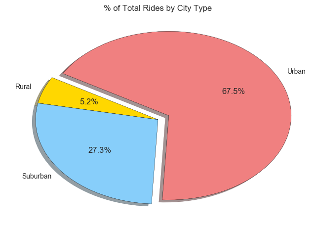

# Pyber 
Analyzing and visualizing ride share data for urban, suburban, and rural city types.

## Tools Used
* Pandas
* Numpy
* Matplotlib
* Seaborn

## Findings

* About 70% of all rides and total fares are riders in the Urban cities.
* While comprising of roughly 35% of all rides and fares, Suburban and Rural cities afford only 22% of Pyber's total driver population. There may be a strategic opportunity here to boost driver counts in these regions to enhance market share.
* Rural riders tend to take significantly higher cost, albeit fewer, trips than Urban or Suburban riders.

## Visualizations

### Bubble Plot of Ride Sharing Data

### Total Fares by City Type

### Total Rides by City Type

### Total Drivers by City Type

